<p align="center">
  
</p>

<p align="center">
  <a href="https://www.linkedin.com/in/jose-su%C3%A1rez-b346b9405"></a>
  <a href="https://house-of-decks.com"></a>
  
</p>

```ts
const jose = {
  location: "Tenerife, Spain 🌋",
  role: "Software Engineer - backend & full-stack",
  education: [
    "BSc Computer Science Engineering · Universidad de La Laguna (2026)",
    "MSc Cloud Development & Operations · Universidad Europea (in progress)",
  ],
  experience: "Software Engineering Intern · Atos Consulting Canarias",
  currentlyBuilding: "house-of-decks.com - real-time multiplayer card games",
  lookingFor: ["Junior Backend", "Full-Stack", "Cloud / DevOps"],
};
```

## 🚀 Featured projects

<table>
  <tr>
    <td width="50%" valign="top">
      <h3>🃏 <a href="https://house-of-decks.com">House of Decks</a></h3>
      <p>Real-time multiplayer card game platform, <b>live in production</b>.</p>
      <ul>
        <li>Server-authoritative gameplay over WebSockets</li>
        <li>Shared game engine: turns, AI bots, versioned migrations</li>
        <li>Custom auth with OAuth 2.0 and password recovery</li>
        <li>Docker on a self-managed Linux VPS, CI/CD with GitHub Actions</li>
      </ul>
      <p>
        
        
        
        
      </p>
    </td>
    <td width="50%" valign="top">
      <h3>🏥 <a href="https://github.com/josesuarezfel/surgical-waitlist-dashboard">Surgical Waitlist Dashboard</a></h3>
      <p>Bachelor's thesis · <b>graded 8.8/10</b>.</p>
      <ul>
        <li>KPI dashboard to monitor and prioritize surgical waiting lists</li>
        <li>Realistic synthetic hospital data generated with the OpenAI API</li>
        <li>Built on real ICD-10-ES diagnosis and procedure codes</li>
      </ul>
      <p>
        
        
        
      </p>
    </td>
  </tr>
</table>

## 🛠️ Tech stack

<p align="center">
  <br>
  
</p>

## ☁️ Right now

- Studying for a Master's in **Cloud Development & Operations**
- Growing **House of Decks** with new games and features
- Open to **junior backend, full-stack and cloud roles**, in Spain or remote

<p align="center"><sub>Made in the Canary Islands 🇮🇨</sub></p>
